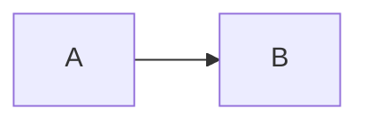

# The Architect's Mind: Site Design Spec

- **Date:** 2026-10-03
- **Author:** Jairam
- **Status:** Approved in brainstorming, pending spec review

## 1. Purpose

A personal website for Jairam called **The Architect's Mind**. It shows how Jairam thinks and works through three kinds of content:

- **Writing**: long-form blog posts.
- **Notes**: short posts and quick tutorials on what Jairam is learning.
- **Projects**: project write-ups, including structured case studies.

**Success criteria**

- Jairam can publish and edit all content from a browser-based CMS. No local tooling is needed.
- Article pages render the following correctly:
  - images
  - full Markdown, including tables
  - highlighted code, with Python as the priority
  - Mermaid diagrams
  - a minimap-style table of contents (TOC)
- The site is hosted free on GitHub Pages. Moving it to Jairam's own custom domain later takes one config change plus DNS records.
- The visual language matches the existing design system in `temp_design.md` ("AIJAY_" CSS).

**Out of scope**

- Tag pages
- RSS feed
- Comments, search, analytics
- Newsletter
- Multiple authors
- The final hero design (placeholder text for now)

## 2. Stack

| Concern | Choice |
|---|---|
| Static site generator | Astro, using Content Collections with typed schemas |
| Hosting | GitHub Pages from a public repo, with "GitHub Actions" as the Pages source |
| Deploy | GitHub Action on push to `main` (official `withastro/action` + `actions/deploy-pages`) |
| CMS | Sveltia CMS, loaded from a CDN at `/admin`, with GitHub backend and personal access token sign-in |
| Code highlighting | Shiki at build time, with a custom theme built from the `--syn-*` tokens |
| Diagrams | Mermaid, rendered client-side and lazy-loaded only on pages that contain a Mermaid block |
| Styling | `temp_design.md` CSS moved to `src/styles/`, extended with the new components listed below |
| Fonts | Bricolage Grotesque (UI and body text), Shantell Sans (handwritten accents), system monospace (code) |

**Cost:** $0, apart from renewing the domain Jairam already owns.

### Custom domain readiness

- **One place for the URL:** `site` and `base` are set only in `astro.config.mjs`.
- **No hard-coded paths:** every internal link and asset path goes through a helper that reads `base`.

Moving to the custom domain later takes four steps:

1. Set `site` to the new domain and remove `base`.
2. Add the domain under repo Settings → Pages.
3. Add the DNS records:
   - Apex domain: `A` records pointing to `185.199.108.153`, `185.199.109.153`, `185.199.110.153` and `185.199.111.153`.
   - `www`: a `CNAME` pointing to `<user>.github.io`.
4. Enforce HTTPS.

## 3. Routes

| Route | Content |
|---|---|
| `/` | Home: Hero → Selected work → Writing → About (`#about`) → Footer |
| `/writing` | All Writing posts as cards in a grid (3 columns on desktop, 1 on mobile), newest first |
| `/writing/<slug>` | Article page |
| `/notes` | Compact rows (date · title · tags), grouped by year, newest first |
| `/notes/<slug>` | Article page, compact variant |
| `/projects` | All projects in the list + sticky stage layout. Full case studies carry a "Case study" label |
| `/projects/<slug>` | Project page: case study header + article body |
| `/about` | Full About page |
| `/404` | Styled not-found page |
| `/admin` | Sveltia CMS |

## 4. Content model

All collections live in `src/content/<collection>/<slug>/index.md`. Images are stored next to the post's `index.md` so Astro can optimise them (resizing, WebP, lazy loading).

- **Validation:** schemas are enforced with Zod. Invalid content fails the build.
- **Drafts:** `draft: true` excludes an entry from production builds. Drafts still show in `npm run dev`. New CMS entries default to `draft: true`.
- **Optional fields:** they appear in the CMS form but can be left empty. Empty fields are not rendered.
- **Reading time:** computed at build time, never entered by hand.

### Writing

| Field | Type | Required |
|---|---|---|
| title | string | yes |
| description | string | yes |
| date | date | yes |
| tags | string[] | yes |
| updated | date | no |
| cover | image | no |
| featured | boolean | no |
| draft | boolean | no (CMS default true) |

### Notes

| Field | Type | Required |
|---|---|---|
| title | string | yes |
| date | date | yes |
| tags | string[] | yes |
| description | string | no |
| draft | boolean | no (CMS default true) |

### Projects

| Field | Type | Required |
|---|---|---|
| title | string | yes |
| summary | string | yes |
| stack | string[] | yes |
| date | date | yes |
| links.repo, links.demo | url | no |
| role | string | no |
| timeline | string | no |
| problem | string (short markdown) | no |
| constraints | string (short markdown) | no |
| outcome | string (short markdown) | no |
| lessons | string (short markdown) | no |
| cover | image (shown in the stage panel) | no |
| featured | boolean | no |
| draft | boolean | no (CMS default true) |

The body holds the Approach / Architecture write-up. A project renders the **full case study header** when `problem` or `outcome` is set. Otherwise it renders the **light** variant: summary, stack and links only.

### About (single entry: `src/content/pages/about.md`)

| Field | Type | Purpose |
|---|---|---|
| intro | string (short markdown) | Home page `#about` section |
| now | list of {label, value} | Home page "now" list |
| body | markdown | `/about` page |

### Site settings (single entry: `src/content/settings/site.json`)

| Field | Type |
|---|---|
| heroHeadline, heroNote | string (placeholder text for now) |
| footerStatement, footerSub | string |
| socials | list of {label, url, meta, note} (drives the footer links and their popovers) |

## 5. Pages

### Global

- **Nav:**
  - Wordmark "The Architect's Mind" on the left.
  - Writing · Notes · Projects · About on the right.
  - **About** links to `/#about`. That scrolls in place on the home page and navigates there from other pages.
  - A light/dark toggle sets `data-theme` on `<html>`. It defaults to the system setting and saves the choice in `localStorage`, wrapped in try/catch.
- **Footer:**
  - Large display statement and sub line, both from site settings.
  - Social links with hover popovers (`.pop`).
  - Signature line.

### Home

1. **Hero:**
   - Headline from site settings, using the `.mark` highlight.
   - Handwritten side note.
   - CTAs: **View projects** (`.btn-primary` → `/projects`) and **Read my writing** (`.btn-text` with scribble → `/writing`).
2. **Selected work:**
   - Up to 5 projects in `.proj-list`, featured first and then the newest. Shown with the sticky `.stage` panel showing the hovered or active project's cover.
   - If a project has no cover, the stage shows its title and stack on the dot grid.
   - Ends with an **All projects →** link (`.more`).
3. **Writing:** 3 posts as `.post` cards, featured first and then the newest. Then **All writing →**.
4. **About (`#about`):** intro, now list (`.now`), and a **Learn more about me →** button linking to `/about`.
5. **Footer.**

**Card fallback thumbnail:** when a Writing post has no `cover`, its card shows a dot-grid panel with the first tag in Shantell Sans.

## 6. Article page

This one renderer is shared by Writing, Notes and Projects.

### Layout

- **Reading column:** about 70ch wide, centred.
- **TOC rail:** sticky, in the left margin, on viewports 1100px and wider.

### Header

| Type | Header content |
|---|---|
| Writing | tags · reading time, H1 title, description (lead), date and updated date, optional cover |
| Notes | date and tags, H1 title. No cover |
| Projects | see Project header below |

### TOC (minimap rail)

The data source is the H2 and H3 headings Astro generates for each page. The TOC shows only when a page has 3 or more headings.

- **At rest:**
  - One dash per heading.
  - Dash width is proportional to the heading text length, clamped.
  - H3 dashes are shorter and indented.
  - The active heading has a brighter, longer dash and a vertical marker bar.
- **On hover or focus-within:** the rail expands into a card listing the heading text, with the active heading highlighted.
- **Interaction:**
  - Clicking a heading smooth-scrolls to it. This respects `prefers-reduced-motion`.
  - An IntersectionObserver tracks which heading is active.
- **Accessibility:** the rail is `<nav aria-label="Contents">` containing real links, so it works with keyboard alone.
- **Below 1100px:** the rail is replaced by a collapsible `<details>` "Contents" panel under the header.

### Markdown rendering

- **Headings:** hover shows a `#` anchor link.
- **Tables:** hairline row dividers, wrapped in a horizontally scrollable container.
- **Images:** optimised by Astro, with `--r-md` radius. The Markdown image title becomes a caption.
- **Other elements:** blockquotes, lists, inline code and `hr` use the existing tokens.
- **Callouts:** GitHub-style syntax (`> [!NOTE]`, `> [!TIP]`, `> [!WARNING]`).

### Code blocks

- **Look:** always dark, styled like the `.ide` window.
- **Header bar:** shows `title` (or the language) and a Copy button.
- **Highlighting:** Shiki with a custom theme mapped to the `--syn-*` and `--ide-*` tokens.
- **Supported options:**
  - `title="file.py"`
  - highlighted line ranges (`{3-5}`)
  - diff lines (`+` / `-`)

### Mermaid

````

````

- **Loading:** the build turns each Mermaid block into a placeholder. A client script loads Mermaid only when a placeholder exists on the page.
- **Appearance:** diagrams render inside a dot-grid "whiteboard" panel (styled like `.stage`), themed from the design tokens (ink, card and line colours, plus the Bricolage font).
- **Theme changes:** the diagram re-renders when the theme changes.
- **Failure:** if rendering fails, the panel shows the raw source as a code block.

### Project header

- **Summary:** shown as the lead.
- **Meta grid:** Role · Timeline · Stack (chips) · Links.
- **Problem / Constraints / Outcome:** three cards, each shown only when its field is set.
- **Body:** the Markdown body follows the header.
- **Lessons:** shown at the end in a handwritten-style callout (Shantell Sans).

### Footer of the article

- **Writing:** Previous and Next links within Writing.
- **Notes and Projects:** a link back to the section index.

## 7. CMS (Sveltia)

- **Files:**
  - `public/admin/index.html` loads Sveltia from a CDN.
  - `public/admin/config.yml` defines the CMS.
- **Backend:** `github`, pointing at this repo and branch `main`.
- **Sign-in:** a personal access token. It should be a fine-grained token limited to this repo, with Contents: read/write.
- **Collections:**
  - Writing, Notes and Projects are folder collections.
    - Each uses `path: "{{slug}}/index"` and stores media alongside the post (`media_folder: ""`, `public_folder: ""`).
    - Fields mirror Section 4, and `draft` defaults to true.
  - About and Site settings are file collections.
- **Preview limit:** the CMS preview shows plain Markdown. Shiki highlighting, Mermaid and the TOC render only on the live site.

## 8. Build and deploy

- **Pipeline:** a push to `main` triggers `.github/workflows/deploy.yml`, which runs install → `astro check` → `astro build` → deploy to Pages.
- **Speed:** a CMS save reaches the live site in about 1–2 minutes.
- **Failure:** a failed build leaves the last good deploy live. GitHub flags the failure in the Actions tab and by email.

## 9. Error handling

| Failure | Behaviour |
|---|---|
| Missing required field or wrong type | Build fails with a schema error naming the file and field |
| Broken image path | Build fails (Astro resolves images at build time) |
| Invalid Mermaid syntax | Page builds; the panel shows the source instead of the diagram |
| Unknown URL | Styled 404 page |
| `localStorage` unavailable | Theme toggle still works for the session, falling back to the system setting |

## 10. Testing and verification

- **CI:** `astro check` plus `astro build` must pass.
- **Starter content:** written to exercise every feature:
  - **Writing:** 2 posts. One is a kitchen sink with tables, Python, diff and titled code, Mermaid, callouts, images, and H2/H3 depth.
  - **Notes:** 2, one short (no TOC) and one with 3 or more headings.
  - **Projects:** 2, one full case study and one light project (one of them with a cover).
  - **About:** the About entry.
  - **Site settings:** the settings entry.
- **Manual checks:**
  - light and dark themes, at widths of 375px, 768px and 1440px
  - TOC using only the keyboard
  - Mermaid re-rendering on theme change
  - `prefers-reduced-motion`
- **End-to-end:** in `/admin`, create a note, commit, and confirm it appears on the live site after deploy.

## 11. Open items (deferred)

- Hero design and final copy.
- Custom domain cutover (steps in Section 2).
