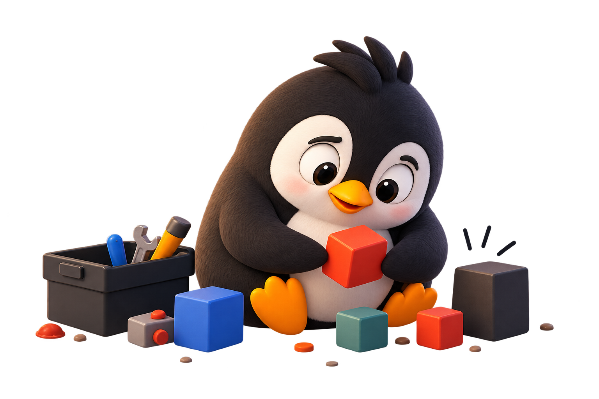
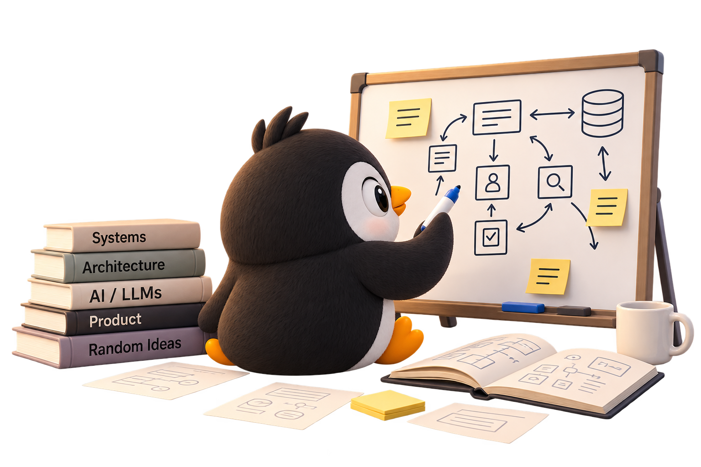
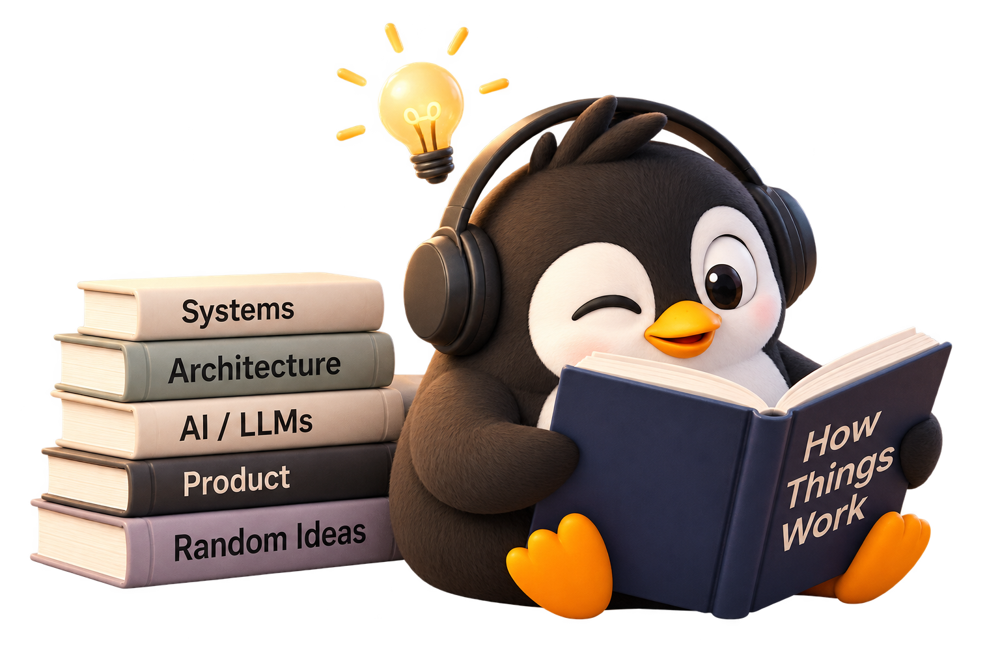

## What I do

These days, that usually means AI systems, agents, retrieval, software architecture, and figuring out how to make all of them behave when they meet the real world.

## Why I enjoy it

I enjoy the part where a simple idea turns into a messy system. The unexpected failure. The strange edge case. The question that starts with “why did that happen?” and somehow ends three hours later with a whiteboard full of arrows.

## How I learn

I learn mostly by building, breaking things, figuring out why, and building them again. I dive deep into docs, read, experiment, and sometimes go down rabbit holes — even the ones I probably didn’t need to go down.

## And Pico?

This site is where I keep the things worth remembering: ideas I’m exploring, systems I’m designing, things I’ve learned the hard way, and the occasional rabbit hole I probably didn’t need to go down—but did anyway.
