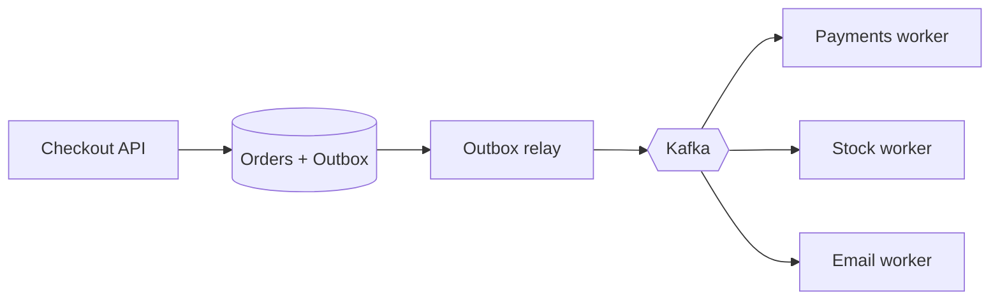

## Approach

We moved side effects behind an outbox and let consumers retry independently.

## Architecture

```mermaid
graph LR
  API[Checkout API] --> DB[(Orders + Outbox)]
  DB --> Relay[Outbox relay]
  Relay --> Bus{{Kafka}}
  Bus --> Pay[Payments worker]
  Bus --> Stock[Stock worker]
  Bus --> Mail[Email worker]
```

## Rollout

Dual-write for two weeks, compare, then cut over per region.
