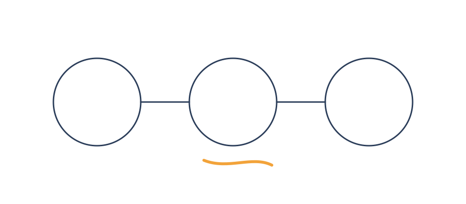
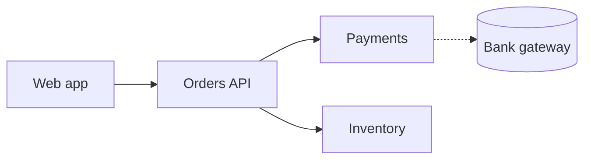
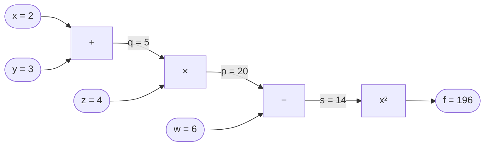

Every distributed system is a failure-handling system that sometimes does useful work. This post is the checklist I reach for.

## Why failure is the default

Networks drop packets, disks fill up and deploys go sideways. Treat each dependency call as **a question that might not get an answer**.

> Hope is not a strategy. Timeouts are.

- Every call gets a timeout
- Every retry gets a budget
- Every queue gets a limit

## Mapping the blast radius



### Drawing the dependency graph



> [!NOTE]
> Dotted edges are calls we do not control. Those get the strictest timeouts.

### Choosing `dataclass` vs `TypedDict`

Use a `dataclass` when the data has behaviour; use a `TypedDict` for plain JSON payloads at the edges.

## Retries without regret

> [!TIP]
> Jitter matters more than the backoff curve. Without it, retries arrive in synchronised waves.

### A retry budget in Python

```python title="retry.py" {6-8}
import random
import time
from collections.abc import Callable


def retry[T](fn: Callable[[], T], attempts: int = 3, base: float = 0.2) -> T:
    """Call fn, backing off exponentially with jitter between failures."""
    for attempt in range(1, attempts + 1):
        try:
            return fn()
        except TimeoutError:
            if attempt == attempts:
                raise
            time.sleep(base * 2**attempt * random.random())
    raise AssertionError("unreachable")
```

```python title="client.py"
def fetch_orders(client):
    return client.get("/orders")  # [!code --]
    return retry(lambda: client.get("/orders"), attempts=4)  # [!code ++]
```

> [!WARNING]
> Never retry non-idempotent writes without an idempotency key.

## Comparing strategies

| Strategy | Protects against | Cost |
|---|---|---|
| Timeout | Hung dependencies | Lost slow-but-OK responses |
| Retry with jitter | Transient errors | Extra load |
| Circuit breaker | Cascading failure | Fast failures during recovery |
| Bulkhead | Noisy neighbours | Idle capacity |

## Diagram fallback

A computational graph for **f = ((x + y) × z − w)²**: each node is one simple operation, and each edge carries the value computed so far. If a diagram ever has a syntax error, the page still works and shows its source instead.



---

## Closing thoughts

Design the failure path first; the happy path is the easy part.
